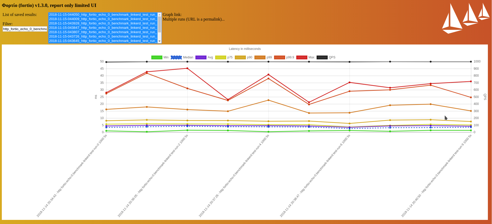
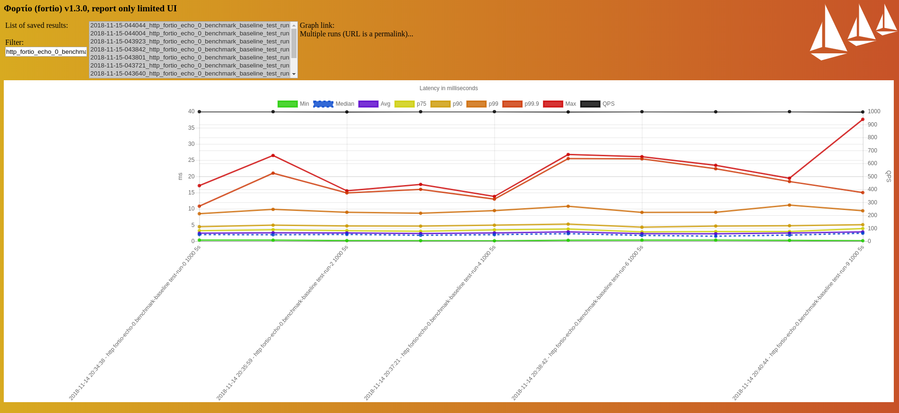

# Linkerd2 Benchmark
This project contains scripts to benchmark the [Linkerd2](https://linkerd.io/) proxy using [Fortio](https://fortio.org/).

Fortio is used as both the load generator and the echo server because of its lightweight footprint, its support for HTTP, HTTP2, GRPC and TLS, with minimal dependencies and configurations. For more information on Fortio (includings its difference with [wrk](https://github.com/wg/wrk)), refer to this [FAQ](https://github.com/fortio/fortio/wiki/FAQ#i-want-to-get-the-best-results-what-flags-should-i-pass).

* [Minikube](#minikube)
* [Docker](#docker)

## Minikube
To run the minikube.sh script, you will need:

* [Minikube 0.30.0](https://github.com/kubernetes/minikube/releases/tag/v0.30.0) - ingress and storage class add-ons enabled.

The script starts up a load generator [job](https://kubernetes.io/docs/concepts/workloads/controllers/jobs-run-to-completion/) to perform a series of HTTP and GRPC load tests on 2 Fortio echo servers.

It creates the following 4 namespaces:

* `linkerd`: This namespace has the Linkerd2 control plane.
* `benchmark-load`: This namespace has the load generator and report server.
* `benchmark-baseline`: This namespace serves as the baseline with 2 deployments of the Fortio echo servers.
* `benchmark-linkerd`: The Fortio echo server pods in this namespace are meshed with the Linkerd2 proxy.

By default, the load generator hits each echo server pod with 1000 HTTP requests/second and 1000 GRPC requests/second, for a duration of 5 seconds each. It repeats this load 10 times on both the baseline echo servers and the meshed echo servers. The JSON report files are persisted in the Minikube `/tmp` folder via persistent volume claim resources, and are accessible via the ingress set-up.

Usage:
```
$ INIT=true ./minikube.sh
```
The above command will:

* Build the load generator in Minikube
* Install Linkerd2 control plane
* Set up the baseline namespace
* Set up the Linkerd2-meshed namespace
* Run the load tests
* Make the report available via the report server ingress

To view the reports, visit `http://<your_minikube_ip>`

For example,


_The response time of 10 runs of the HTTP load test on the baseline pods_


_The response time of 10 runs of the HTTP load test on the Linkerd2-meshed pods_

The echo servers are accessible via their designated node ports, which can be obtained using the `kubectl -n <benchmark_namespace> get svc -o wide` command (i.e. `http://<your_minikube_ip>:<node_port>/fortio`). The server UI provides further insight into its internal PPROF.

To view all supported environment variables:
```
$ ./minikube.sh -h
```

To delete all the resources, run:
```
$ CLEANUP=true ./minikube.sh
```

The `yaml` folder contains the specifications of the `Deployment` and `Job` resources. It also has the Dockerfile that is used to generate the load generator Docker image.

## Docker

To run the `docker.sh` script, you will need:

* [Docker](https://docs.docker.com/install/linux/docker-ce/ubuntu/)
* [Fortio v1.3.0](https://github.com/fortio/fortio)

The `docker.sh` script creates a local Docker network linking 2 echo servers and 1 load generator. The load generator sends HTTP and GRPC load to both echo servers. This script doesn't install Linkerd2. The reports are stored in the `reports` folder.


Usage:
```
$ INIT=true ./docker.sh
```
The above command will set up the Docker containers and run the load tests. All the report JSON files will be saved in the git-ignored reports/ folder by default.

To view the reports:
```
$ fortio report -data-dir reports/docker.sh/samples
```

To view all supported environment variables:
```
$ docker.sh -h
```
