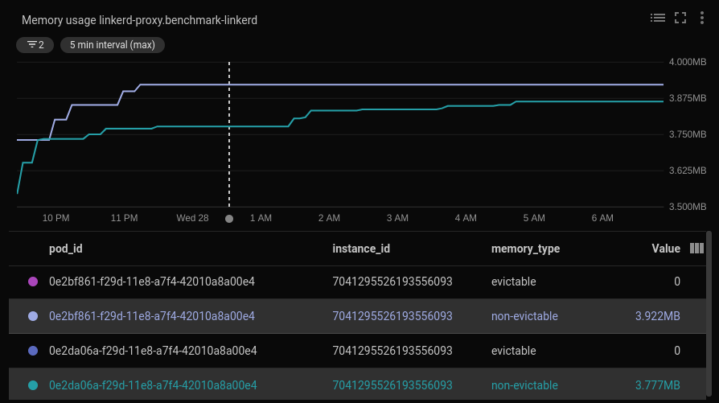
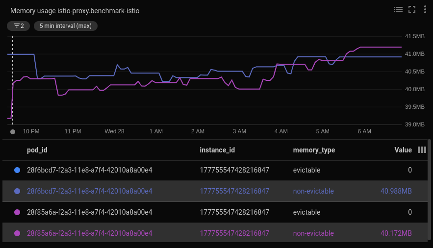
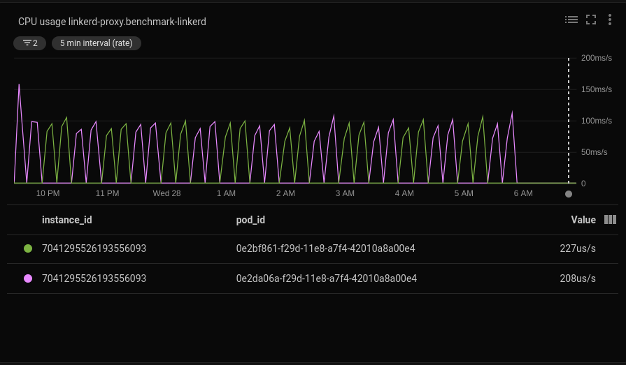
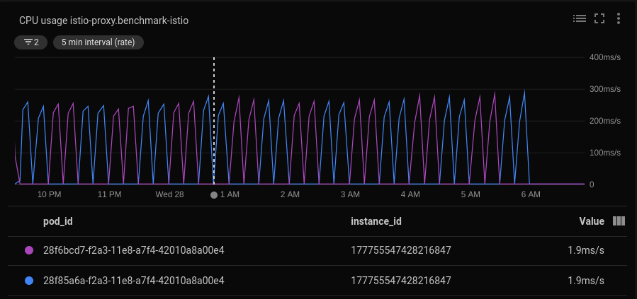

# Report
This report contains the result of my performance test in a GKE environment. The report charts can be viewed at http://ld2.isim.me

All the report logs are available in the same folder as this README.

* [Environment Set-up](#environment-set-up)
* [How To Read The Charts](#how-to-read-the-charts)
* [Scenarios](#scenarios)
  * [Scenario 1 - Maximum QPS](#scenario-1---maximum-qps)
  * [Scenario 2 - Increasing Load](#scenario-2---increasing-load)

## Environment Set-up
The scripts used in this experiment runs Istio 1.0.3, Linkerd2 edge-18.11.1 and Fortio 1.3.1 on a GKE 1.11.2-gke.18 cluster in the us-west1-a zone. They perform a series of  load tests by using the Fortio load generator to send HTTP and GRPC requests to the baseline, Linkerd2-meshed and Istio-meshed Fortio echo servers.

The GKE cluster used for this experiment is comprised of the following node pools:

Node Pool Name   | Machine Type                | k8s Namespace                            | Node Taint                   | # of Echo Servers
---------------- | --------------------------- | ---------------------------------------- | ---------------------------- | -----------------
`system`         | n1-standard-2               | `kube-system`, `linkerd`, `istio-system` | None                         | N/A
`baseline`       | n1-standard-1 (preemptible) | `benchmark-baseline`                     | `app-family: baseline`       | 2
`linkerd-meshed` | n1-standard-1 (preemptible) | `benchmark-linkerd2`                     | `app-family: linkerd-meshed` | 2
`istio-meshed`   | n1-standard-1 (preemptible) | `benchmark-istio`                        | `app-family: istio-meshed`   | 2
`load-generator` | n1-standard-1               | `benchmark-load`                         | `app-family: load-generator` | N/A

The Istio control plane is installed based on the recommended Helm-based production installation instructions found [here](https://istio.io/docs/setup/kubernetes/helm-install/).

The Terraform scripts used to provision the cluster can be found in the [gke](../../gke) folder.

## How To Read The Charts
Navigate to http://ld2.isim.me

* To view the histogram of a single test run, select its label from the list.
* To compare the results of multiple test runs, hold down your SHIFT key while selecting their labels.
* The filter text field can be used to facilitate more detailed comparisons between the test runs. For example, to view the results of all the 120 qps HTTP tests of the baseline echo servers, enter _http_baseline_120qps_ in the filter and hit ENTER.
* The legend of every chart can be clicked to toggle the inclusion or exclusion of data on the chart.

When 3 or more charts are combined,

* Each dot on the colored lines corresponds to the primary (left) y-axis, representing the min, median, max and different percentiles latencies.
* The top black line corresponds to the secondary (right) y-axis, indicating the qps rate.

## Scenarios
### Scenario 1 - Maximum QPS
This scenario begins with an attempt to determine how much load the echo servers can handle under the current set-up. This is achieved by setting the Fortio load generator's `-qps` option to 0, for maximum queries per second rate. The [test script](../../gke.sh) performs a series of 10 test runs where each run targets the echo servers with a 30-second HTTP load and a 30-second GRPC load, using 32 concurrent connections.

The report logs can be found in the [report-0qps-30s-32c.log](report-0qps-30s-32c.log) and [report-0qps-30s-32c-round2.log](report-0qps-30s-32c-round2.log) file.

The command used was:
```
$ CMD=RUN_TESTS QUERIES_PER_SECOND_HTTP=0 QUERIES_PER_SECOND_GRPC=0 CONNECTIONS_COUNT=32 TEST_RUN_DURATION=30s  ./gke.sh
```

The following are the URLs to the corresponding charts. Disable the _max_ measurements to exclude the outliers to see the more consistent p99.9 measurements.

Test Case            | URL                                         | Parameters And Response Time(ms)
-------------------- | ------------------------------------------- | --------------------------------
HTTP Baseline        | http://ld2.isim.me/?s=http_baseline_0qps_30 | Duration: 30s<br>qps range: 29.0k - 32.6k<br>Concurrent connections: 32<br>p99.9: 5.79ms - 6.19ms
HTTP Linkerd2-meshed | http://ld2.isim.me/?s=http_linkerd_0qps_30  | Duration: 30s<br>qps range: 10.8k - 11.3k<br>Concurrent connections: 32<br>p99.9: 8.97ms - 11.07ms
HTTP Istio-meshed    | http://ld2.isim.me/?s=http_istio_0qps_30    | Duration: 30s<br>qps range: 3.2k - 3.9k<br>Concurrent connections: 32<br>p99.9: 34.78ms - 72.00ms
GRPC Baseline        | http://ld2.isim.me/?s=grpc_baseline_0qps_30 | Duration: 30s<br>qps range: 14.3k - 16.1k<br>Concurrent connections: 32<br>p99.9: 9.25ms - 11.75ms
GRPC Linker2-meshed  | http://ld2.isim.me/?s=grpc_linkerd_0qps_30  | Duration: 30s<br>qps range: 6.5k - 8.2k<br>Concurrent connections: 32<br>p99.9: 11.99ms - 16.51ms
GRPC Istio-meshed    | http://ld2.isim.me/?s=grpc_istio_0qps_30    | Duration: 30s<br>qps range: 2.8k - 3.3k<br>Concurrent connections: 32<br>p99.9: 37.24ms - 75.20ms

Once the maximum qps is determined, per recommendation in the Fortio [FAQ](https://github.com/fortio/fortio/wiki/FAQ#i-want-to-get-the-best-results-what-flags-should-i-pass), the next test suite in this scenario attempts to load-test the echo servers at 75% of the of the previously determined maximum qps. A total of 10 test runs are performed, with each run is configured to last for 5 minutes. In order to avoid incurring any sleep warnings, the lowest qps rates from the Istio-meshed runs are applied to all runs i.e. 0.75 * 3192 qps for HTTP load and 0.75 * 2817 qps for GRPC.

The report logs can be found in the [report-2374qps-5m-32c.log](report-2374qps-5m-32c.log) and [report-http-2374qps-grpc-2113qps-32c.log](report-http-2374qps-grpc-2113qps-32c.log) files.

The command used was:
```
$ CMD=RUN_TESTS QUERIES_PER_SECOND_HTTP=2374 QUERIES_PER_SECOND_GRPC=2113 CONNECTIONS_COUNT=32 TEST_RUN_DURATION=5m  ./gke.sh
```

The following are the URLs to the corresponding charts. Disable the _max_ measurements to remove the outliers. The p99.9 and below measurements are quite consistent.

Test Case            | URL                                            | Parameters And Response Time (ms)
-------------------- | ---------------------------------------------- | ---------------------------------
HTTP Baseline        | http://ld2.isim.me/?s=http_baseline_2374qps_5m | Duration: 5m<br>qps: 2374<br>Concurrent connections: 32<br>p99.9: 5.13ms - 5.85ms
HTTP Linkerd2-meshed | http://ld2.isim.me/?s=http_linkerd_2374qps_5m  | Duration: 5m<br>qps: 2374<br>Concurrent connections: 32<br>p99.9: 7.82ms - 11.47ms
HTTP Istio-meshed    | http://ld2.isim.me/?s=http_istio_2374qps_5m    | Duration: 5m<br>qps: 2374<br>Concurrent connections: 32<br>p99.9: 34.48ms - 53.32ms
GRPC Baseline        | http://ld2.isim.me/?s=grpc_baseline_2113qps_5m | Duration: 5m<br>qps: 2113<br>Concurrent connections: 32<br>p99.9: 9.52ms - 11.21ma
GRPC Linker2-meshed  | http://ld2.isim.me/?s=grpc_linkerd_2113qps_5m  | Duration: 5m<br>qps: 2113<br>Concurrent connections: 32<br>p99.9: 10.74ms - 13.70ms
GRPC Istio-meshed    | http://ld2.isim.me/?s=grpc_istio_2113qps_5m    | Duration: 5m<br>qps: 2113<br>Concurrent connections: 32<br>p99.9: 63.36ms - 47.21ms

[GCP Stackdriver](https://cloud.google.com/stackdriver/) was used to capture the following memory and CPU usage data. Refer to the Stackdriver [docs](https://cloud.google.com/monitoring/api/metrics_gcp#gcp-container) for definitions of _CPU usage_ and _memory usage_.


_Figure 1 - Linkerd2 proxy memory usage_


_Figure 2 - Istio proxy memory usage_


_Figure 3 - Linkerd2 proxy CPU usage_


_Figure 4 - Istio proxy CPU usage_

### Scenario 2 - Increasing Load
In this scenario, the [gke_stress.sh script](../../gke_stress.sh) is used to generate a series of test runs, where subsequent run's qps rate is increased by 500 units. Each run is made up of a 10-second HTTP load and a 10-second GRPC load. The initial qps rate is 120 qps, with 4 concurrent connections. The next run has a qps rate of 500 qps. This increase in the qps rate continues until the final rate of 2000 qps.

The following are the URLs to the corresponding HTTP charts. Disable the _max_ measurements to remove the outliers. The p99.9 and below measurements are quite consistent.

Test Suite                       | URL                                             | Parameters And Respones Time (ms)
-------------------------------- | ----------------------------------------------- | ---------------------------------
HTTP baseline at 120 qps         | http://ld2.isim.me/?s=http_baseline_120qps_10s  | Duration: 10s<br>qps: 120<br>Concurrent connections: 4<br>p99.9: 1.59ms - 4.68ms
HTTP baseline at 500 qps         | http://ld2.isim.me/?s=http_baseline_500qps_10s  | Duration: 10s<br>qps: 500<br>Concurrent connections: 4<br>p99.9: 3.33ms - 5.80ms
HTTP baseline at 1000 qps        | http://ld2.isim.me/?s=http_baseline_1000qps_10s | Duration: 10s<br>qps: 1000<br>Concurrent connections: 4<br>p99.9: 3.46ms - 4.60ms
HTTP baseline at 1500 qps        | http://ld2.isim.me/?s=http_baseline_1500qps_10s | Duration: 10s<br>qps: 1500<br>Concurrent connections: 4<br>p99.9: 3.79ms - 4.68ms
HTTP baseline at 2000 qps        | http://ld2.isim.me/?s=http_baseline_2000qps_10s | Duration: 10s<br>qps: 2000<br>Concurrent connections: 4<br>p99.9: 3.84ms - 4.62ms
HTTP Linkerd2-meshed at 120 qps  | http://ld2.isim.me/?s=http_linkerd_120qps_10s   | Duration: 10s<br>qps: 120<br>Concurrent connections: 4<br>p99.9: 2.48ms - 5.75ms
HTTP Linkerd2-meshed at 500 qps  | http://ld2.isim.me/?s=http_linkerd_500qps_10s   | Duration: 10s<br>qps: 500<br>Concurrent connections: 4<br>p99.9: 4.44ms - 28.75ms
HTTP Linkerd2-meshed at 1000 qps | http://ld2.isim.me/?s=http_linkerd_1000qps_10s  | Duration: 10s<br>qps: 1000<br>Concurrent connections: 4<br>p99.9: 4.41ms - 5.40ms
HTTP Linkerd2-meshed at 1500 qps | http://ld2.isim.me/?s=http_linkerd_1500qps_10s  | Duration: 10s<br>qps: 1500<br>Concurrent connections: 4<br>p99.9: 4.81ms - 10ms
HTTP Linkerd2-meshed at 2000 qps | http://ld2.isim.me/?s=http_linkerd_2000qps_10s  | Duration: 10s<br>qps: 2000<br>Concurrent connections: 4<br>p99.9: 4.53ms - 5.25ms<br>Number of _sleep falling behind_ events: 1
HTTP Istio-meshed at 120 qps     | http://ld2.isim.me/?s=http_istio_120qps_10s     | Duration: 10s<br>qps: 120<br>Concurrent connections: 4<br>p99.9: 5.12ms - 21.55ms
HTTP Istio-meshed at 500 qps     | http://ld2.isim.me/?s=http_istio_500qps_10s     | Duration: 10s<br>qps: 500<br>Concurrent connections: 4<br>p99.9: 7.00ms - 17.00ms
HTTP Istio-meshed at 1000 qps    | http://ld2.isim.me/?s=http_istio_1000qps_10s    | Duration: 10s<br>qps: 500<br>Concurrent connections: 4<br>p99.9: 13.86ms - 24.17ms
HTTP Istio-meshed at 1500 qps    | http://ld2.isim.me/?s=http_istio_1500qps_10s    | Duration: 10s<br>qps: 1200<br>Concurrent connections: 4<br>p99.9: 13.61ms - 17.63ms<br>Number of _sleep falling behind_ events: 20
HTTP Istio-meshed at 2000 qps    | http://ld2.isim.me/?s=http_istio_2000qps_10s    | Duration: 10s<br>qps: 2000<br>Concurrent connections: 4<br>p99.9: 13.89ms - 16.55ms<br>Number of _sleep falling behind_ events: 20

The following are the URLs to the corresponding GRPC charts. Disable the _max_ measurements to remove the outliers. The p99.9 and below measurements are quite consistent.

Test Suite                       | URL                                             | Parameters And Respones Time (ms)
-------------------------------- | ----------------------------------------------- | ---------------------------------
GRPC baseline at 120 qps         | http://ld2.isim.me/?s=grpc_baseline_120qps_10s  | Duration: 10s<br>qps: 120<br>Concurrent connections: 4<br>p99.9: 2.90ms - 5.35ms
GRPC baseline at 500 qps         | http://ld2.isim.me/?s=grpc_baseline_500qps_10s  | Duration: 10s<br>qps: 500<br>Concurrent connections: 4<br>p99.9: 3.50ms - 5.67ms
GRPC baseline at 1000 qps        | http://ld2.isim.me/?s=grpc_baseline_1000qps_10s | Duration: 10s<br>qps: 1000<br>Concurrent connections: 4<br>p99.9: 4.44ms - 5.26ms
GRPC baseline at 1500 qps        | http://ld2.isim.me/?s=grpc_baseline_1500qps_10s | Duration: 10s<br>qps: 1500<br>Concurrent connections: 4<br>p99.9: 4.62ms - 5.42ms
GRPC baseline at 2000 qps        | http://ld2.isim.me/?s=grpc_baseline_2000qps_10s | Duration: 10s<br>qps: 2000<br>Concurrent connections: 4<br>p99.9: 4.66ms - 4.96ms
GRPC Linkerd2-meshed at 120 qps  | http://ld2.isim.me/?s=grpc_linkerd_120qps_10s   | Duration: 10s<br>qps: 120<br>Concurrent connections: 4<br>p99.9: 4.95ms -  50.54ms
GRPC Linkerd2-meshed at 500 qps  | http://ld2.isim.me/?s=grpc_linkerd_500qps_10s   | Duration: 10s<br>qps: 500<br>Concurrent connections: 4<br>p99.9: 5.17ms - 8.40ms
GRPC Linkerd2-meshed at 1000 qps | http://ld2.isim.me/?s=grpc_linkerd_1000qps_10s  | Duration: 10s<br>qps: 1000<br>Concurrent connections: 4<br>p99.9: 5.40ms - 10.00ms
GRPC Linkerd2-meshed at 1500 qps | http://ld2.isim.me/?s=grpc_linkerd_1500qps_10s  | Duration: 10s<br>qps: 1500<br>Concurrent connections: 4<br>p99.9: 5.0ms - 5.87ms
GRPC Linkerd2-meshed at 2000 qps | http://ld2.isim.me/?s=grpc_linkerd_2000qps_10s  | Duration: 10s<br>qps: 2000<br>Concurrent connections: 4<br>p99.9: 5.57ms - 6.00ms
GRPC Istio-meshed at 120 qps     | http://ld2.isim.me/?s=grpc_istio_120qps_10s     | Duration: 10s<br>qps: 120<br>Concurrent connections: 4<br>p99.9: 5.51ms - 10.17ms
GRPC Istio-meshed at 500 qps     | http://ld2.isim.me/?s=grpc_istio_500qps_10s     | Duration: 10s<br>qps: 500<br>Concurrent connections: 4<br>p99.9: 6.89ms - 17.20ms
GRPC Istio-meshed at 1000 qps    | http://ld2.isim.me/?s=grpc_istio_1000qps_10s    | Duration: 10s<br>qps: 1000<br>Concurrent connections: 4<br>p99.9: 17.07ms - 27.09ms<br>Number of _sleep falling behind_ events: 1
GRPC Istio-meshed at 1500 qps    | http://ld2.isim.me/?s=grpc_istio_1500qps_10s    | Duration: 10s<br>qps: 1500<br>Concurrent connections: 4<br>p99.9: 16.63ms - 19.58ms<br>Number of _sleep falling behind_ events: 20
GRPC Istio-meshed at 2000 qps    | http://ld2.isim.me/?s=grpc_istio_2000qps_10s    | Duration: 10s<br>qps: 2000<br>Concurrent connections: 4<br>p99.9: 16.29ms - 19.26ms<br>Number of _sleep falling behind_ events: 19

Other interesting charts:

Test Suite                         | URL
-----------------------------------| -----------------------------------
HTTP baseline for all qps          | http://ld2.isim.me/?s=http_baseline
HTTP Linkerd2-meshed for all qps   | http://ld2.isim.me/?s=http_linkerd
HTTP Istio-meshed for all qps      | http://ld2.isim.me/?s=http_istio
GRPC baseline for all qps          | http://ld2.isim.me/?s=grpc_baseline
GRPC Linkerd2-meshed for all qps   | http://ld2.isim.me/?s=grpc_linkerd
GRPC Istio-meshed for all qps      | http://ld2.isim.me/?s=grpc_istio

With 4 concurrent connections, the _sleep falling behind_ warnings are observable in tests with at least 1000 qps. According to the Fortio [FAQ](https://github.com/fortio/fortio/wiki/FAQ#i-want-to-get-the-best-results-what-flags-should-i-pass), this warning signifies that fortio and the system can't sustain that qps, divided equally across the requested number of connections. Most of the sleep warnings are associated with the Istio-meshed echo servers.

All the report logs can be found in the same [reports/gke](report/gke) folder.
