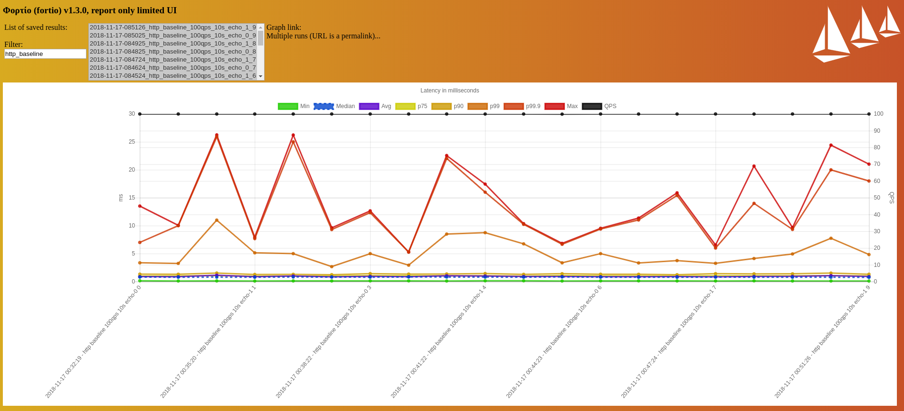
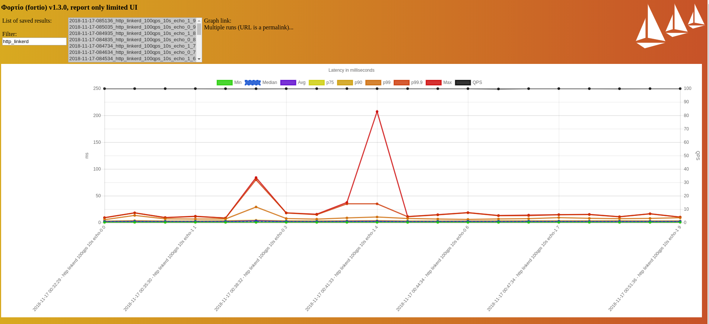
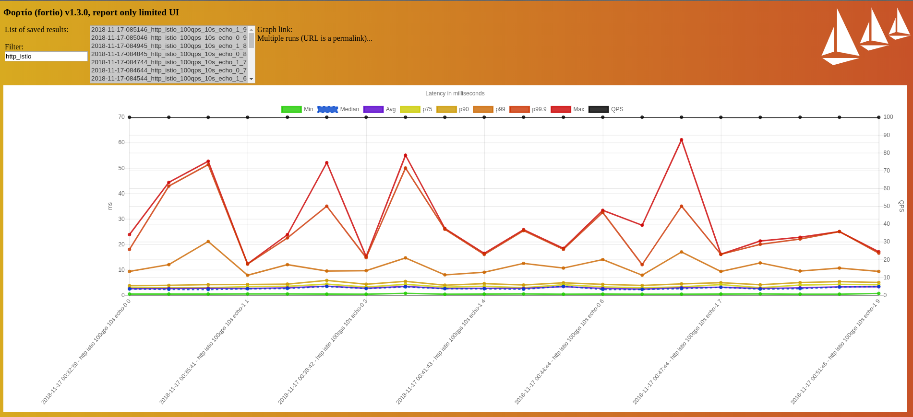
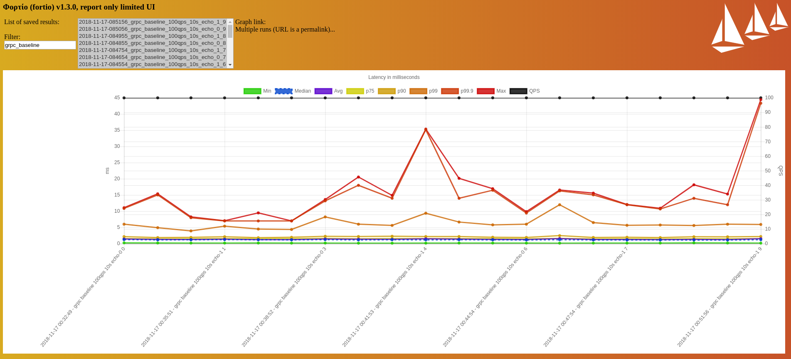
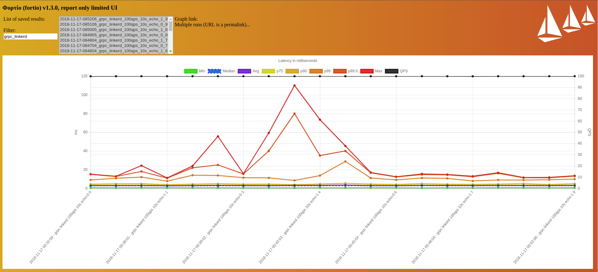
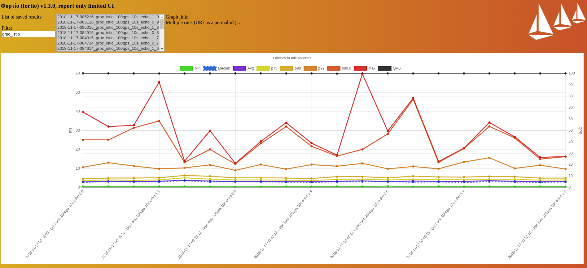
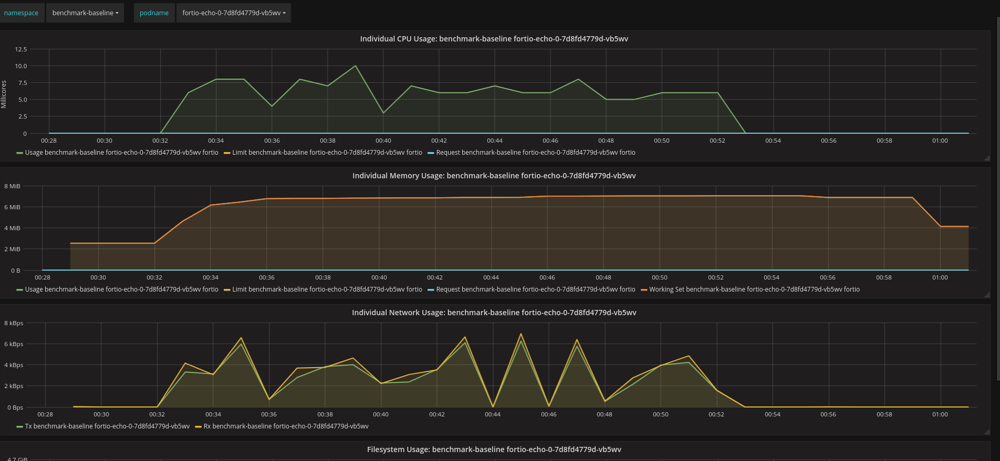
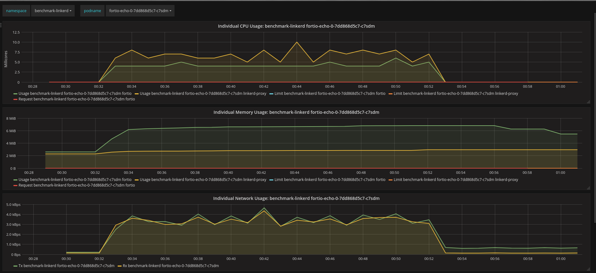
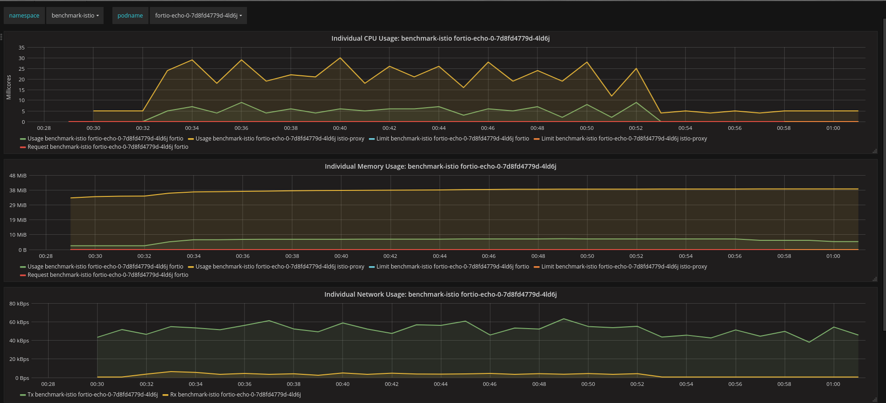

# Report
This report contains the result of my load tests in a Minikube set-up. The report logs can be found [here](report.log).

## Environment Set-up
The [script](../../minikube.sh) used in this experiment runs Istio 1.0.3, Linkerd2 edge-18.11.1 and Fortio 1.3.1 on a Minikube (v0.30.0) instance of 4 CPUs and 8096 RAM of memory, per resource recommendation from the [Istio documentation](https://istio.io/docs/setup/kubernetes/platform-setup/minikube/). The Istio control plane is installed based on the recommended Helm-based production installation instructions found [here](https://istio.io/docs/setup/kubernetes/helm-install/).

During each test run, the Fortio load generator sends two loads of requests at a rate of 100 queries/second to the Fortio echo servers, for a total of 10 seconds. (IOW, each load consists of 1000 queries over a 10 seconds duration.) The first load consists of HTTP requests, and the second load is comprised of GRPC requests. A total of 10 test runs are performed on the baseline, Linkerd2-meshed and Istio-meshed echo servers.

The following are the response time and resource utilization reports (click to enlarge images):

* The vertical axis represents a single test run of 100 qps over a period of 10 seconds.
* The top black line indicates the queries per second. A dip in this line indicates a sleep event that occurs because Fortio and your machine can't sustain the qps divided equally across the requested number of connections.
* Each dot on the colored lines represents the min, median, max and different percentiles latencies.

### HTTP Tests

Figure 1 shows the result of the HTTP load tests against 2 baseline echo servers. The p99s hover between 5.26ms and 26.2ms.

_Figure 1: HTTP load test with baseline (unmeshed) echo servers_

Figure 2 shows the result of the HTTP load tests against 2 linkerd2-meshed echo servers. There are two outliers with p99.9s at 80ms and 207ms. All the other p99s hover between 9ms and 35ms.

_Figure 2: HTTP load test with Linkerd2-meshed echo servers_

Figure 3 shows the result of the HTTP load tests against 2 istio-meshed echo servers. The p99s hoever between 12ms and 51ms.

_Figure 3: HTTP load test with Istio-meshed echo servers_

### GRPC Tests

Figure 4 shows the result of the GRPC load tests against 2 baseline echo servers. There are two outliers with p99.9s at 35ms and 44.5ms. All the other p99s hover between 7ms and 18ms.

_Figure 4: GRPC load test with baseline (unmeshed) echo server_

Figure 5 shows the result of the GRPC load tests against 2 linkerd2-meshed echo servers. There are two outliers with p99.9s at 55.6ms and 110.1ms. They belong to the same outlier test runs as seen in the HTTP load test. All the other p99s hover between 15ms and 40ms.

_Figure 5: GRPC load test with Linkerd2-meshed echo server_

Figure 6 shows the result of the GRPC load tests against 2 Istio-meshed echo servers. The p99s hoever between 14ms and 46ms.

_Figure 6: GRPC load test with Istio-meshed echo server_

### Resource Utilization

Figure 7 shows the resource charts of one of the baseline echo servers throughout the 10 test runs.

_Figure 7: Resource charts of the baseline (unmeshed) echo server_

Figure 8 shows the resource charts of one of the linkerd2-meshed echo servers throughout the 10 test runs.

_Figure 8: Resource charts of the Linkerd2-meshed echo server_

Figure 9 shows the resource charts of one of the istio-meshed echo servers throughout the 10 test runs.

_Figure 9: Resource charts of the Istio-meshed echo server_
